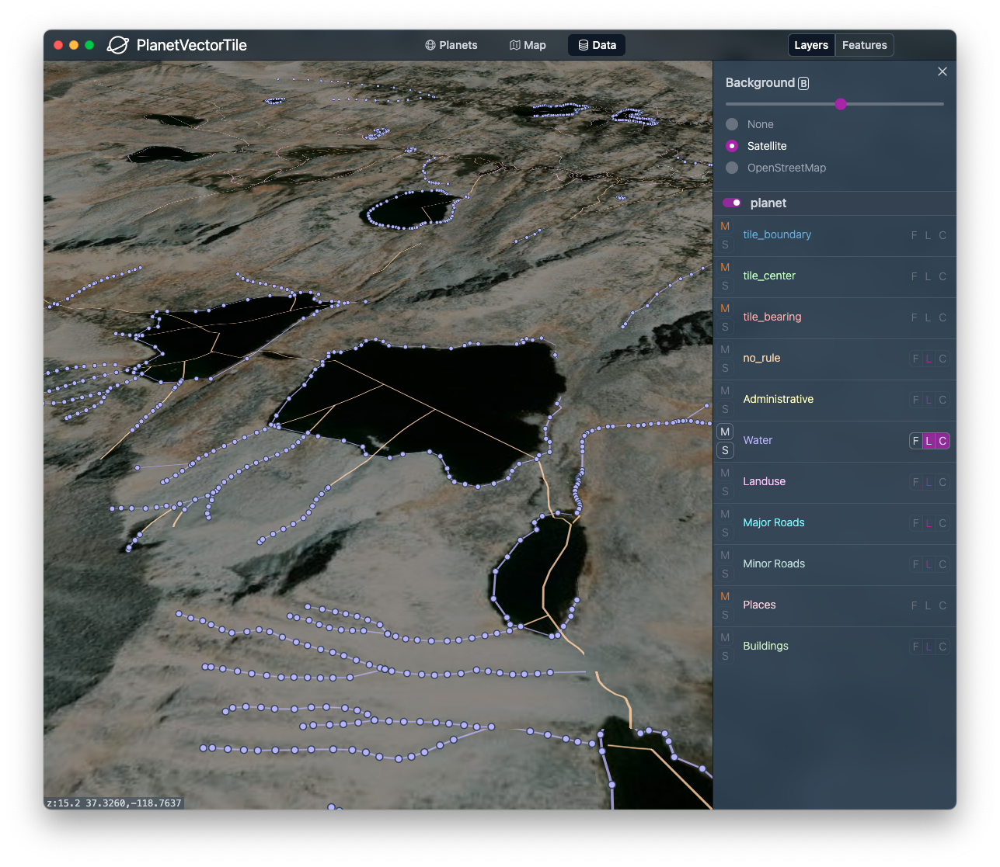

# PlanetVectorTile

PlanetVectorTile is a map engine that focuses on enabling you to have the entire map of the planet on your own computer. The core of the library, written in Rust, is a command line tool, `pvt`, and a native NodeJS module. This binds to a desktop application that allows you to view, style, and navigate your planet dataset--all on your own machine, within the same process.

If you are a map enthusiast that can benefit by having planet-scale spatial data on your own machine and infrastructure, under your own control and ownership, this project may be of interest. There is no database or external dependency. All you need is the compiled binary to run the CLI, and the app package to run the app.

You can use `pvt` to:

- Convert an OSM PBF into the planet binary format, allowing you to render and navigate the planet on your local machine.
- Declare a manifest file that lets you build rules determining what features are in a given layer and zoom range.
- Build a Hilbert Tile tree that provides a spatial index for tiling.
- Create a report providing analysis and statistics about the spatial data you have ingested.

You can build a planet of all of OpenStreetMap on a server with 256GB of RAM in < 1.5hrs. Any machine will do, but your build will take significantly longer. Smaller datasets work fine on a standard laptop (such as an OSM extract of California or the United States).

The desktop application is a tool that allows you to navigate your planet. There are 3 tabs:

- **Planets:** Navigate your local planets.
- **Map:** View your styled map, rendered by the Maplibre/Mapbox style spec.
- **Data:** Navigate and filter the layers of your dataset. Toggle features to explore what is in your map.

We render vector tiles ad hoc in our own [flatbuffer](https://google.github.io/flatbuffers/) format, which is consumed in the app with a custom fork of Maplibre. The planet binary source data is also our own format levraging memory mapped [flatdata](https://github.com/heremaps/flatdata) files.

Nodes, ways, and relations are indexed and tiled using our new Hilbert Tree spatial index, allowing immediate retrival from your memory mapped files. Features that are located near each other on Earth are also located near each other in the binary data. No bounding box search is required for retrival.

## Screenshots




## Project Status

PlanetVectorTile is still under active development. An alpha release should be ready in February 2023.

Currently, you can build a planet with `pvt` and browse your data. The app is not yet feature complete, and not all of the functionality with Relations and multi-polygons are in place.

## Build Dependencies

- Rust >= v1.65
- NodeJS >= v16.17

Install Rust

    curl https://sh.rustup.rs -sSf | sh -s -- -y

Install NodeJS

https://nodejs.org/en/download/

## Clone Repo

    git clone --recursive git@github.com:planet-vector-tile/planet-vector-tile.git

## Install

You can run the install script that will build and install the CLI, MapLibre, and the debug Electron app.

    ./install.sh

## Run the Desktop app.

```
cd desktop
npm i
npm run dev
```

You will need to have the [stylesheet](desktop/styles/default.json) point to the right location of the [planet manifest](manifests/) you want to view.

## Run tests.

First you need to generate the test fixtures.

```
cargo run -r --bin fixtures
```

Then,

```
cargo test
npm test
```

If you are debugging tests and you want to see full output, run:

```
cargo test -- --nocapture
```

## Modify the schema.

If you want to modify the flatdata or flatbuffer schema, you will need to install the corresponding schema compilers.

### 1. Install flatdata flatc schema compiler.

https://github.com/heremaps/flatdata/tree/master/flatdata-generator

    pip3 install flatdata-generator

### 2. Build the flatbuffer schema compiler.

    brew install flatbuffers

or

https://google.github.io/flatbuffers/flatbuffers_guide_building.html

### 3. Regenerate schema

Then run to regnerate schema files:

    npm run generate:schema

## Contributing

You are welcome to submit pull requests to this repo for core PlanetVectorTile changes. If you need to modify MapLibre, you can submit a pull request to the planet branch of:

https://github.com/planet-vector-tile/maplibre-gl-js

Right now we are working on a custom fork of MapLibreGL, and we have not yet coordinated with the MapLibre team to merge the PlanetVectorTile plugin upstream.
